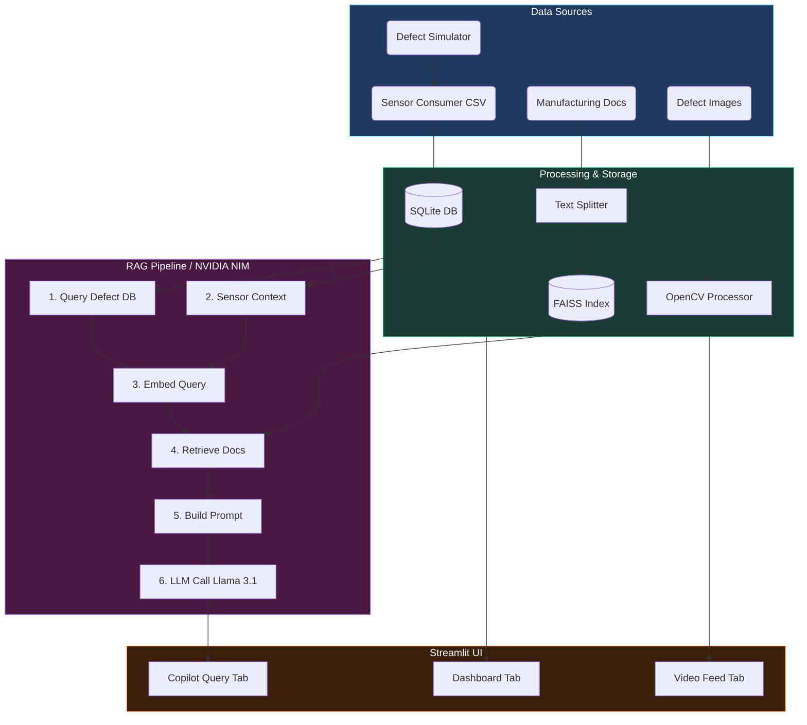

# 🏭 Manufacturing Defect Detection Copilot

An AI-powered manufacturing assistant that ingests simulated production-line video, detects defects, correlates them with sensor signals and historical manufacturing documents, and provides natural-language explanations to operators via a Streamlit web UI — powered by **NVIDIA NIM** API endpoints using RAG (Retrieval-Augmented Generation).


<details>
<summary>Mermaid Diagram Source</summary>


</details>

---

## 🚀 Quick Start — Choose How to Run

### Option A: Run in GitHub Codespaces (Easiest)

Click the button below to launch a fully configured cloud dev environment — no local install needed:

[](https://github.com/ricordoyan/manufacturing-copilot/codespaces/new)

Once the Codespace is ready, skip to **Step 3 (Install dependencies)** below.

### Option B: Download ZIP

1. On the GitHub repo page, click the green **`<> Code`** button → **Download ZIP**.
2. Extract the ZIP to a folder of your choice.
3. Follow the full **Setup Instructions** below.

### Option C: Clone with Git

```bash
git clone https://github.com/ricordoyan/manufacturing-copilot.git
cd manufacturing-copilot
```

---

## Prerequisites

| Requirement | Version / Notes |
|---|---|
| Python | 3.10+ |
| NVIDIA NIM API key | See **Step 4** below |
| Kaggle account | Required to download datasets (free to register) |

---

## Setup Instructions

> **Copy-paste friendly!** Every command below can be run directly in your terminal.

### 1. Navigate into the project folder

If you downloaded the ZIP, first extract it, then:

```bash
cd manufacturing-copilot
```

### 2. Create & activate a virtual environment

**Windows (PowerShell):**

```powershell
python -m venv .venv
.venv\Scripts\Activate.ps1
```

**Windows (Command Prompt):**

```cmd
python -m venv .venv
.venv\Scripts\activate.bat
```

**macOS / Linux:**

```bash
python3 -m venv .venv
source .venv/bin/activate
```

### 3. Install dependencies

```bash
pip install -r requirements.txt
```

### 4. Configure the NVIDIA NIM API Key

This project requires an **NVIDIA NIM API key** to power the LLM and embedding calls.

**Option A — Use the API key already included in the repo:**

A `.env` file with a working API key is already included in this repository. You can use it as-is without any changes.

**Option B — Generate your own API key:**

1. Go to [https://build.nvidia.com/](https://build.nvidia.com/) and sign up / log in.
2. Navigate to any NIM model page and click **"Get API Key"**.
3. Copy your key.
4. Open (or create) a `.env` file in the project root and add:

```env
NVIDIA_API_KEY=nvapi-XXXXXXXXXXXXXXXXXXXXXXXXXXXXXXXXXXXXXXXX
```

> **Note:** If both options are present, the key in your `.env` file will be used.

### 5. Download Datasets from Kaggle

The defect image datasets are **too large to include in this GitHub repository**, so you must download them from Kaggle manually.

> **⚠️ Kaggle Account Required:** If you don't have a Kaggle account, register for free at [https://www.kaggle.com/account/login?phase=startRegisterTab](https://www.kaggle.com/account/login?phase=startRegisterTab) before proceeding.

#### 5a. Download the NEU Surface Defect Detection Dataset (Required)

1. Go to: [https://www.kaggle.com/datasets/kaustubhdikshit/neu-surface-defect-database](https://www.kaggle.com/datasets/kaustubhdikshit/neu-surface-defect-database)
2. Click the **"Download"** button to download the ZIP file (e.g., `archive.zip`).
3. **Move the downloaded ZIP file** into the `data/sample_images/` folder:

**Windows (PowerShell):**

```powershell
# Adjust the source path to wherever your browser saved the file
Move-Item "$HOME\Downloads\archive.zip" "data\sample_images\archive.zip"
```

**macOS / Linux:**

```bash
mv ~/Downloads/archive.zip data/sample_images/archive.zip
```

4. **Unzip the dataset** inside `data/sample_images/`:

**Windows (PowerShell):**

```powershell
Expand-Archive -Path "data\sample_images\archive.zip" -DestinationPath "data\sample_images\" -Force
```

**macOS / Linux:**

```bash
unzip data/sample_images/archive.zip -d data/sample_images/
```

5. Verify the folder structure looks like this:

```
data/sample_images/
├── NEU-DET/
│   ├── train/
│   │   ├── images/
│   │   │   ├── crazing_1.bmp
│   │   │   ├── inclusion_1.bmp
│   │   │   ├── patches_1.bmp
│   │   │   ├── pitted_surface_1.bmp
│   │   │   ├── rolled-in_scale_1.bmp
│   │   │   └── scratches_1.bmp
│   │   │   └── ... (1,800 images total)
│   │   └── annotations/
│   │       └── ... (Pascal-VOC XML files)
│   └── validation/
│       ├── images/
│       └── annotations/
```

#### 5b. Download the Severstal Steel Defect Detection Dataset (Optional)

1. Go to: [https://www.kaggle.com/c/severstal-steel-defect-detection/data](https://www.kaggle.com/c/severstal-steel-defect-detection/data)
2. Click **"Download All"** to download the ZIP (e.g., `severstal-steel-defect-detection.zip`).
3. Move and unzip it into `data/sample_images/`:

**Windows (PowerShell):**

```powershell
Move-Item "$HOME\Downloads\severstal-steel-defect-detection.zip" "data\sample_images\severstal-steel-defect-detection.zip"
Expand-Archive -Path "data\sample_images\severstal-steel-defect-detection.zip" -DestinationPath "data\sample_images\severstal-steel-defect-detection\" -Force
```

**macOS / Linux:**

```bash
mv ~/Downloads/severstal-steel-defect-detection.zip data/sample_images/severstal-steel-defect-detection.zip
unzip data/sample_images/severstal-steel-defect-detection.zip -d data/sample_images/severstal-steel-defect-detection/
```

The application automatically:
- Parses XML annotations and draws **bounding boxes** on detected defects
- Extracts the **ground-truth defect type** from filenames (e.g., `crazing_1.bmp` → crazing)
- Provides a dedicated **NEU-DET Dataset Browser** tab with per-category browsing and statistics

### 6. Generate synthetic sensor data

```bash
python generate_sensor_data.py
```

This creates `data/sensor_data.csv` with 192 rows of realistic sensor readings spanning a full shift (06:00–22:00) on Production Line 3, including a simulated cooling-valve drift incident.

### 7. Run the setup script

```bash
python setup_rag.py
```

This script:
- Loads and chunks documents from `docs/`
- Embeds chunks via the NVIDIA NIM embedding API
- Builds a FAISS vector index
- Initialises the SQLite database
- Populates defect events from the sensor CSV

### 8. Launch the application

```bash
streamlit run app.py
```

The UI will open at `http://localhost:8501`.

---

## Usage Guide

### Copilot Query Tab

Ask natural-language questions about production behaviour. The copilot retrieves relevant historical documents and correlates them with real-time sensor data.

**Example questions:**

- *"Why did the defect rate increase in the last hour on production line 3?"*
- *"What was the forming zone temperature when surface cracks started appearing?"*
- *"Has coolant valve V-17 caused issues before? What was the fix?"*
- *"Recommend corrective actions for the current defect spike."*
- *"Show me the correlation between coolant flow and defect rate."*

### Dashboard Tab

Real-time sensor charts:
- **Forming Zone Temperature** with warning (185°C) and critical (195°C) threshold lines
- **Defect Rate** over time
- **Coolant Flow %** over time
- Table of recent defect events

### Video Feed Tab

Displays sample images from `data/sample_images/` with anomaly detection overlays. When viewing **NEU-DET images**, the system uses ground-truth labels and draws bounding boxes from the XML annotations. For other images, a heuristic OpenCV-based detector is used. Click **Run Defect Simulation** in the sidebar to start the simulator.

### NEU-DET Dataset Tab

A dedicated browser for the NEU Surface Defect Database:
- **Dataset overview** — total images, category counts, bar chart
- **Category browser** — select a defect type (crazing, inclusion, patches, pitted_surface, rolled-in_scale, scratches) and navigate through images
- **Side-by-side view** — original image vs. annotated image with bounding boxes
- **Annotation details** — bounding box coordinates and labels
- **Grid preview** — thumbnail grid of the first 12 images per category

---

## Architecture Overview

```
┌────────────────┐    ┌──────────────────┐    ┌───────────────┐
│  Sensor CSV /  │    │  Manufacturing   │    │  Sample       │
│  Defect Sim    │    │  Documents       │    │  Images       │
└───────┬────────┘    └────────┬─────────┘    └───────┬───────┘
        │                      │                       │
        ▼                      ▼                       ▼
┌───────────────┐    ┌──────────────────┐    ┌───────────────┐
│  SQLite DB    │    │  FAISS Vector    │    │  OpenCV       │
│  (defect      │    │  Index           │    │  Processor    │
│   events)     │    │  (doc chunks)    │    │  (heuristic)  │
└───────┬───────┘    └────────┬─────────┘    └───────────────┘
        │                      │
        ▼                      ▼
┌─────────────────────────────────────────────────────────────┐
│                    RAG Pipeline                             │
│  1. Query defect summary from DB                            │
│  2. Query sensor context from DB                            │
│  3. Retrieve relevant doc chunks from FAISS                 │
│  4. Assemble structured prompt                              │
│  5. Call NVIDIA NIM LLM (Llama 3.1 70B)                     │
└─────────────────────────────┬───────────────────────────────┘
                              │
                              ▼
                    ┌──────────────────┐
                    │  Streamlit UI    │
                    │  (4-tab layout)  │
                    └──────────────────┘
```

**Data flow:**
1. `generate_sensor_data.py` creates a synthetic CSV with a cooling-valve drift narrative.
2. `setup_rag.py` ingests documents into a FAISS index and populates the SQLite DB.
3. When an operator asks a question, the RAG pipeline:
   - Pulls defect statistics and sensor readings from SQLite.
   - Embeds the query and retrieves the most relevant document chunks from FAISS.
   - Assembles everything into a structured prompt.
   - Sends it to the NVIDIA NIM LLM endpoint (Llama 3.1 70B Instruct).
4. The Streamlit UI displays the answer with source citations and latency metrics.

---

## Technology Stack

| Component | Technology |
|---|---|
| **UI** | Streamlit |
| **LLM** | NVIDIA NIM — Meta Llama 3.1 70B Instruct |
| **Embeddings** | NVIDIA NIM — nv-embedqa-e5-v5 |
| **Vector Store** | FAISS (CPU) |
| **Database** | SQLite |
| **Vision** | OpenCV (heuristic anomaly detection) |
| **Document Processing** | LangChain RecursiveCharacterTextSplitter |
| **Data** | Pandas, NumPy |
| **API Client** | OpenAI Python SDK (NVIDIA-compatible) |

---

## Latency & Scale Considerations

> *This section is a placeholder for the candidate to fill in with their analysis.*

- **Embedding latency:** Batch size of 10 balances throughput with API rate limits. Larger batch sizes may reduce total wall-clock time but risk 429 errors.
- **FAISS search:** IndexFlatL2 performs exact nearest-neighbour search — O(n) per query. For production scale (>100k chunks), consider IndexIVFFlat or IndexHNSW for sub-linear search.
- **LLM latency:** Dominated by the NVIDIA NIM API round-trip (~1–3s for 1024 tokens). Streaming responses could improve perceived latency.
- **Database:** SQLite is single-writer; for concurrent multi-line monitoring, migrate to PostgreSQL.
- **Real-time video:** The OpenCV heuristic runs locally in <50ms per frame. A production deployment would use NVIDIA NIM vision models with GPU inference for higher accuracy.

---

## Project Structure

```
manufacturing-copilot/
├── README.md
├── requirements.txt
├── .env.example
├── config.py                       # Environment variables & constants
├── app.py                          # Streamlit UI (4 tabs)
├── setup_rag.py                    # One-time setup: ingest docs + build DB
├── generate_sensor_data.py         # Generate synthetic sensor CSV
├── detection/
│   ├── __init__.py
│   ├── video_processor.py          # OpenCV frame processing + NEU-DET integration
│   ├── defect_simulator.py         # Replay sensor CSV as event stream
│   └── neu_det_loader.py           # NEU-DET annotation parser & dataset browser
├── data/
│   ├── sensor_data.csv             # (generated)
│   └── sample_images/              # (user-provided defect images)
│       └── NEU-DET/                # NEU Surface Defect Database (6 categories)
├── docs/                           # (user-provided manufacturing docs)
├── db/
│   ├── __init__.py
│   └── database.py                 # SQLite CRUD for defect events
├── rag/
│   ├── __init__.py
│   ├── ingest.py                   # Document loading + FAISS indexing
│   ├── retriever.py                # Vector similarity search
│   └── generator.py                # Prompt assembly + LLM call
└── utils/
    ├── __init__.py
    └── metrics.py                  # Latency tracking
```

---

## License

MIT
